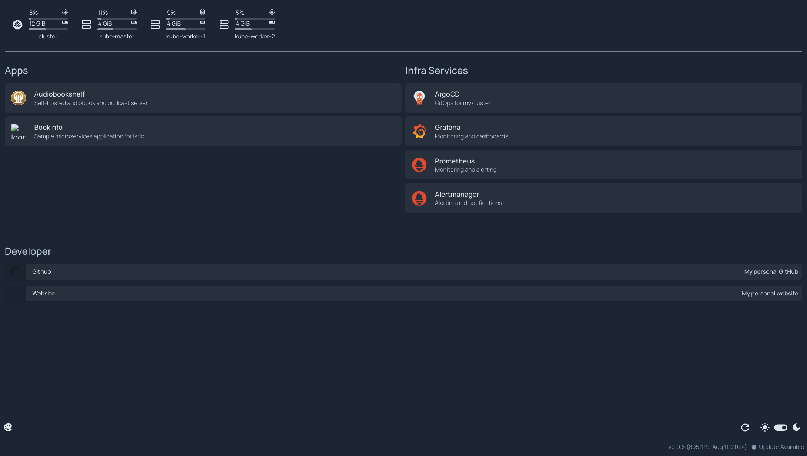

# Homelab

This repo contains the configuration files and scripts for managing my Kubernetes homelab infrastructure. 

All apps are deployed/configured via GitOps using ArgoCD.

## :computer: Hardware
The homelab consists of Dell OptiPlex servers, each with the following specifications:

:green_circle: 3x Nodes :green_circle:

* **Model**: Dell Optiplex 7040 Desktop PC Mini
* **CPU**: Intel i5-6500T
* **RAM**: 16GB DDR4
* **Storage**: 256GB SSDs
* **OS**: Ubuntu 24

## :rocket: Installed Apps & Tools

### Apps
End User Applications
<table>
    <tr>
        <th>Logo</th>
        <th>Name</th>
        <th>Description</th>
    </tr>
    <tr>
        <td></td>
        <td><a href="https://www.audiobookshelf.org/">Falco</a></td>
        <td>Self-hosted audiobook and podcast server</td>
    </tr>
</table>

### System
Applications/services core to the cluster
<table>
    <tr>
        <th>Logo</th>
        <th>Name</th>
        <th>Description</th>
    </tr>
    <tr>
        <td></td>
        <td><a href="https://argo-cd.readthedocs.io/en/stable/">ArgoCD</a></td>
        <td>Argo CD is a declarative, GitOps continuous delivery tool for Kubernetes.</td>
    </tr>
    <tr>
        <td></td>
        <td><a href="https://goauthentik.io/">Authentik</a></td>
        <td>Used for SSO and other auth workflows.</td>
    </tr>
    <tr>
        <td></td>
        <td><a href="https://cert-manager.io/">cert-manager</a></td>
        <td>X.509 certificate management for Kubernetes.</td>
    </tr>
    <tr>
        <td></td>
        <td><a href="https://developers.cloudflare.com/cloudflare-one/">Cloudflare Zero Trust</a></td>
        <td>Used for private tunnels to expose public services (without requiring a public IP).</td>
    </tr>
    <tr>
        <td></td>
        <td><a href="https://grafana.com/">Grafana</a></td>
        <td>The open observability platform.</td>
    </tr>
    <tr>
        <td></td>
        <td><a href="https://prometheus.io/">Prometheus</a></td>
        <td>An open-source monitoring system with a dimensional data model, flexible query language, efficient time series database and modern alerting approach.</td>
    </tr>
    <tr>
        <td></td>
        <td><a href="https://github.com/renovatebot/renovate">Renovate</a></td>
        <td>Automated dependency updates.</td>
    </tr>
    <tr>
        <td></td>
        <td><a href="https://github.com/bitnami-labs/sealed-secrets">Sealed Secrets</a></td>
        <td>A Kubernetes controller and tool for one-way encrypted Secrets.</td>
    </tr>
</table>

### Tools
Tools used for managing the cluster

<table>
    <tr>
        <th>Logo</th>
        <th>Name</th>
        <th>Description</th>
    </tr>
    <tr>
        <td></td>
        <td><a href="https://www.ansible.com/">Ansible</a></td>
        <td>An automation platform for bootstrapping the physical nodes.</td>
    </tr>
</table>

## :camera: Demo/Images

### Home Page

## :gear: Bootstrapping Steps

1. [Bootstrap servers](guide/0-bootstrap.md)
2. [Setup Kubernetes cluster](guide/1-setup-kubernetes-cluster.md)
3. [Setup local DNS](guide/3-setup-local-dns.md)
4. [Deploy applications](guide/4-deploy-applications.md)

## :heavy_check_mark: TODO

- [x] Setup federated identity for apps
- [x] Setup cloudflare tunnel for public access
- [x] Setup Falco for runtime security
